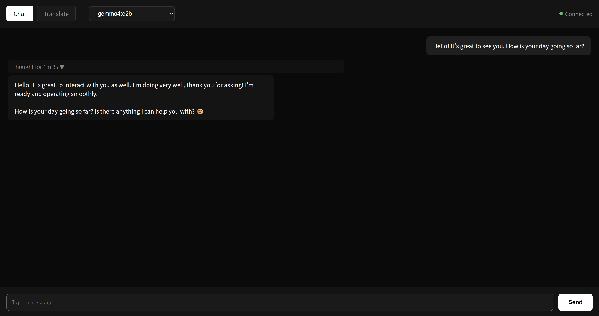
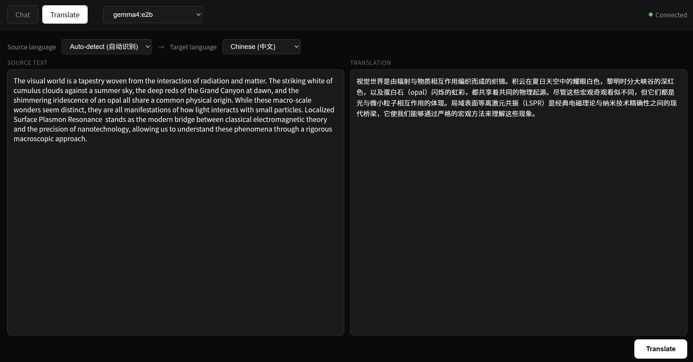

  

<h1 align="center">LyraUI</h1>

A minimal, fast Chrome extension for chatting with local Ollama models

  <a href="README.md">English</a>
  &nbsp;|&nbsp;
  <a href="README-zh.md">中文</a>

---

## Features

- **Streaming Chat** — Real-time token streaming with context memory
- **Thinking Preview** — Expandable "thinking" block for reasoning models (DeepSeek, QwQ, etc.)
- **Translate Panel** — Built-in translation with 12 languages, stream output
- **Zero Config** — Detects all local Ollama models automatically
- **Lightweight** — Vanilla JS with no build step and no framework dependency

## Installation

### From Release

1. Download the latest `.zip` from [Releases](https://github.com/chinskylee/LyraUI/releases) and unzip it
2. Open `chrome://extensions` in your Chromium browser
3. Enable **Developer mode** (top right)
4. Click **Load unpacked** and select the unzipped folder

### From Source

1. Clone this repo and open `chrome://extensions` in your Chromium browser
2. Enable **Developer mode** (top right)
3. Click **Load unpacked** and select the project folder

> Requires [Ollama](https://ollama.com) running locally on `127.0.0.1:11434`

## Usage

| Action | How |
|--------|-----|
| Open Chat | Click extension icon in toolbar |
| Send message | `Enter` |
| New line | `Shift + Enter` |
| Switch model | Dropdown in header |
| Translate | Switch to **Translate** tab, `Ctrl + Enter` to run |

### Translation

The Translate panel supports 12 languages with stream output. For best results, we recommend using **translategemma series models**, e.g., `translategemma:4b` for balanced speed and quality. The prompt follows the official translategemma format with source language selection (default: auto-detect).

## Examples

### Chat with Gemma 4

*Chat interface greeting Gemma 4:2b model*

### Translate Blog Introduction

*Translating the introduction of my blog post*

## Tech Stack

- Manifest V3 (service worker + `declarativeNetRequest`)
- Vanilla HTML/CSS/JS — no frameworks, no build tools
- Ollama REST API (`/api/chat`, `/api/tags`) with streaming

## Why "LyraUI"?

Lyra is a small but bright northern constellation. This extension is the same — compact, focused, and your window to local AI.

## License

MIT

## Acknowledgments

- [Page Assist](https://github.com/n4ze3m/page-assist) — The project that inspired this extension
- [DeepSeek-V4-Pro](https://deepseek.com) — For powering the development process
- [NanoBanana2](https://gemini.google/overview/image-generation/) — Assisted in creating the logo, which presents a deeper, more stable, and visually comfortable layout, like a bright constellation perfectly suspended at the center of a browser tab